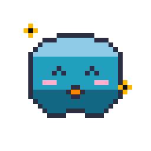

<div align="center">
  
  <h1>tomodachi 🐾</h1>
  <p>a terminal companion that judges your workflow</p>
</div>

---

### what is this?



tomodachi is a desktop pet that lives on your screen and reacts to your terminal commands. it hooks directly into your shell (zsh, powershell, or cmd) and pays attention to what you're doing.

run `cargo build` and it passes? tomodachi gets happy.
run a command that typos and exits with code 127? tomodachi gets anxious.
push code? tomodachi gets smug. 

<br clear="left"/>

it's basically a tamagotchi but for your terminal.

### features

- **zero bloat**: written entirely in rust. uses `winit` and `softbuffer` to render raw pixels. no webview, no heavy gpu rendering.
- **shell agnostic**: hooks into zsh, powershell, and cmd (via clink).
- **the weekly roast**: it logs your commands locally to a sqlite db and can generate a roast summarizing your bad habits (like how many times you mistyped `cargo` or piped an internet url into bash).
- **customizable**: toggle movability or change opacity straight from the system tray.

### how to use

the easiest way is to just grab `tomodachi-setup.exe` from the releases page and run it. it'll install everything for you and register it as an app by 3otxe. it just runs as a background daemon in your system tray and hooks into your terminal invisibly.

if you wanna build it yourself for some reason:
```powershell
git clone https://github.com/3otxe/tomodachi.git
cd tomodachi
./build_installer.ps1
# then run tomodachi-setup.exe
```

or if you hate guis:
```bash
./install.sh # or ./install.ps1
```

### why did i make this?

because coding alone is boring and i wanted something to judge me when i write bad commands.

### license

mit or whatever, do what you want with it.
